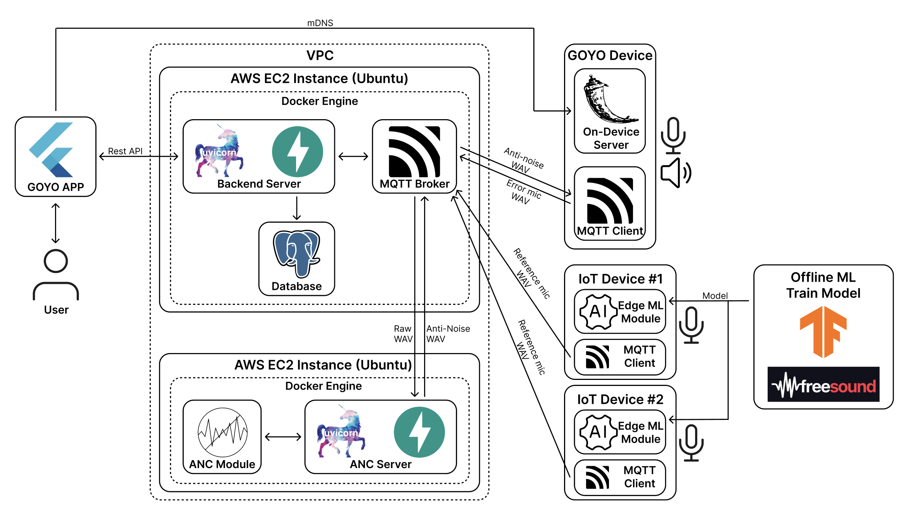

# GOYO: An AI-Based Active Noise Control System for Smart Home Environments

---

## 💁🏻‍♂️ Proposal

This project proposes an AI-based active noise control system for smart home environments requiring sustained concentration, such as studying or remote working. The system addresses continuous low-frequency noise from household appliances like air conditioners and refrigerators that gradually reduce user focus.

The system assumes a fully connected IoT home where each major appliance is equipped with an edge AI model that classifies noise signatures in real time and transmits the analyzed data to an ANC module. The core interface is a smart chair equipped with near-ear microphones and speakers that deliver localized active noise cancellation directly at the user's ears. Using classified noise information from distributed IoT appliances, the ANC module generates phase-inverted control signals through the chair's speakers to cancel unwanted sounds in real time.

This research demonstrates how a home-wide IoT sensing network with edge AI processing combined with localized noise control can enhance concentration and reduce auditory fatigue in everyday smart home environments.

---

## ⚙️ System Architecture

---

## 📹 Video
**Click below image to watch our demo video**

---

## 🔗 Links

[GOYO | Tech Blog](http://bit.ly/4aBjRQY)

[GOYO | System Documentation - PDF](./Documents/GOYO.pdf)

[GOYO | System Documentation - LaTeX](./Documents/GOYO.tex)

[GOYO | PPT](./~~최종본업로드!) 

---

## 👨🏻‍💻 Team Members  

| Name | Organization | Email |
|------|---------------|-------|
| Taerim Kim | Department of Information Systems, Hanyang University | [trnara5375@gmail.com](mailto:trnara5375@gmail.com) |
| Wongyu Lee | Department of Information Systems, Hanyang University | [onew2370@hanyang.ac.kr](mailto:onew2370@hanyang.ac.kr) |
| Junill Jang | Department of Information Systems, Hanyang University | [jang1161@hanyang.ac.kr](mailto:jang1161@hanyang.ac.kr) |
| Hoyoung Chung | Department of Information Systems, Hanyang University | [sydney010716@gmail.com](mailto:sydney010716@gmail.com) |
